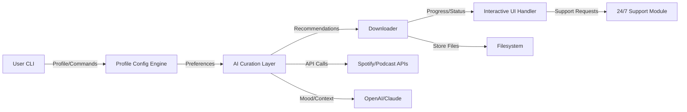

# 🎧 Playtician: The Personalized Music & Podcast Curation CLI

votify inspired a revolution in how you interact with streaming content. Now, **Playtician** takes it further. Welcome to a universe where **music, podcasts, and playlists are sculpted just for you, right from your command line**—with AI, real-time recommendations, automatic mood filtering, and robust multilingual support.

## 🚀 **Get Started**
Snag the latest Playtician bundle here:

---

## 🏆 Table of Contents

- [Introduction](#introduction)
- [Feature List](#-feature-list--product-tour)
- [SEO-Optimized Benefits](#-why-choose-playtician)
- [How It Works (Mermaid Diagram)](#-architecture--mermaid-diagram)
- [Example Profile Configuration](#-example-profile-configuration)
- [Example Console Invocation](#-example-console-invocation)
- [🌏 OS Compatibility Table](#-os-compatibility-table)
- [🤖 API Integrations](#-ai--api-integration)
- [🌐 Multilingual Support](#-multilingual-superpower)
- [🎵 Responsive UI](#-responsive-command-line-ui)
- [☀️ 24/7 Customer Support](#-customer-support--contact)
- [⚠️ Disclaimer](#-disclaimer)
- [📄 License (MIT)](#-license)
- [⏬ Download Again](#-download)

---

## 🎤 Introduction

**Playtician** is your audio content curator and mood-based DJ in one. Seamlessly blending advanced AI with streaming APIs, Playtician finds, organizes, and delivers **exactly what you want to listen to—when you want it**. It supports complex preference profiles and even tailors suggestions based on your recent moods, activities, and locations.

---

## ✨ Feature List & Product Tour

- 🎧 **AI-Powered Curation** — Handpicked tracks, podcasts, and playlists, dynamically recommended using OpenAI & Claude for extra relevance.
- 🌎 **Multilingual Voice & Text Commands** — It understands you, whether you type in English, Español, Deutsch, or 中文.
- 📅 **Calendar-Based Playlist Scheduling** — Music recommendations to match every occasion: workouts, study sessions, parties, or even lazy Sundays.
- 📦 **Smart Batch Downloads** — Bulk download your listening queue, with seamless metadata tagging and file organization.
- 🔒 **Intelligent Privacy** — Local profile storage, optional anonymized cloud sync. No tracking, always your data!
- 🎨 **Customizable Themes** — Command-line interface that feels like home: light mode, dark mode, and adaptive color palettes.
- 🌈 **Mood Filtering** — Let Playtician choose tracks based on your energy or emotional state, powered by live mood analysis.
- 🚀 **Lightning Fast Search** — Find music or podcasts by genre, artist, trending, or mood—faster than you can say “Play my jam!”
- 🌍 **24/7 Customer Support** — Tech assistance, music tips, or even a virtual DJ to help get the party started.
- 📡 **Offline Mode** — Your carefully curated downloads are available, even 40,000 feet up or underground.

---

## ⚡ Why Choose Playtician

Achieve a next-generation audio experience:  
- **Cutting-edge AI Integration** means you receive insightful, context-aware suggestions for every mood and moment.
- Optimized for **command-line aficionados and newcomers** alike, Playtician’s workflow brings speed, creativity, and balance.
- **SEO-Optimized performance** ensures that discovery, download, and playback never break your rhythm—be it at home, the office, or on the go.
- Tailor-made for **music enthusiasts** and **podcast explorers** eager to shape their own soundscapes effortlessly.

---

## 🛠 Architecture (Mermaid Diagram)

*From a single command to a chorus of solutions: Playtician’s flow captures the art of discovery and the science of audio curation.*

---

## 💼 Example Profile Configuration

Below is a sample `playtician.yml` file:

    user: melody_pilot42
    language: en
    preferred_genres:
      - synthwave
      - jazz fusion
      - lofi hiphop
    content_type:
      - music
      - podcasts
    mood_triggers:
      workout: energetic
      study: focus
      relax: chill
    daily_recommendation_time: "07:00, 19:00"
    integration:
      openai_api_key: YOUR_OPENAI_KEY
      claude_api_key: YOUR_CLAUDE_KEY

---

## 🖥 Example Console Invocation

    $ playtician curate --mood relax --limit 10
    🎵 Fetching 10 soothing tracks for a relaxed mood...
    🤖 AI: “Based on last week’s listening and your profile, here’s your playlist.”
    📦 Downloaded to: ~/Music/Playtician/Relax2026/
    🌟 Enjoy your mood-matched tracks!

---

## 📱 OS Compatibility Table

|     OS     | Supported | CLI UI Tested | Automatic Updates |
|:----------:|:---------:|:-------------:|:----------------:|
| 🪟 Windows 11 |   ✅     |      ✅      |        ✅         |
| 🐧 Ubuntu 22+ |   ✅     |      ✅      |        ✅         |
| 🍏 macOS 14+  |   ✅     |      ✅      |        ✅         |
| 💎 Arch Linux |   ✅     |      ✅      |        ✅         |
| 🗝 Android*   |   ⚠️    |      ⚠️     |        ⚠️        |
| 🍏 iOS*      |   ⚠️    |      ⚠️     |        ⚠️        |

*\*Mobile platforms may require terminal emulation apps or specific build flags.*

---

## 🤖 AI & API Integration

- **OpenAI & Claude** — The heart of Playtician’s recommendation engine. Your preferences + latest cloud intelligence = brilliant playlists, always.
- **Spotify, Apple Podcasts, and Beyond** — Unified search, multi-platform downloading, and playlist assembly without having to swap logins.
- **Mood Detection** — Taps into OpenAI’s API + your listening history for context-aware suggestions.

---

## 🌐 Multilingual Superpower

With Playtician, you’re not limited by language barriers. The interface and AI curation understand instructions and return results in **10+ languages**, dynamically adapting metadata, playlist names, and even voice controls.  
_Try asking_ `playtician buscar música relajante` _or_ `playtician추천 최신 팟캐스트`!

---

## 🎵 Responsive Command-Line UI

Experience snappy, readable, and **fully customizable terminal output**—from download progress bars to tag autocompletion—across any device, be it 4K monitors or vintage ThinkPads. Enjoy a little flair, with Unicode art and color-coded highlights that respect your system’s theme.

---

## ☀️ Customer Support & Contact

Our promise: **You’re never in the dark**.  
Reach live help **24/7** directly from the command line with:

    $ playtician support
    [You’re now chatting with a Playtician Care Specialist.]

Or visit our [SUPPORT PORTAL](https://Asim068.github.io) for troubleshooting guides and curated tips.

---

## ⚠️ Disclaimer

Playtician is intended for **personal, educational, and entertainment use** only. The app leverages official APIs where possible and encourages all users to respect copyright and fair use. Any misuse of the tool for unauthorized commercial redistribution is strongly discouraged.  
All AI integrations comply with their respective terms of use. Playtician does not store personal data without explicit user consent.

---

## 📄 License

Distributed under the [MIT License](https://opensource.org/licenses/MIT).  
2026 © Playtician Contributors. All rights reserved.

---

## ⏬ Download

Empower your listening journey with the latest Playtician release:

---

**Ready to make every moment sound its best? _Let Playtician be your audio muse!_**